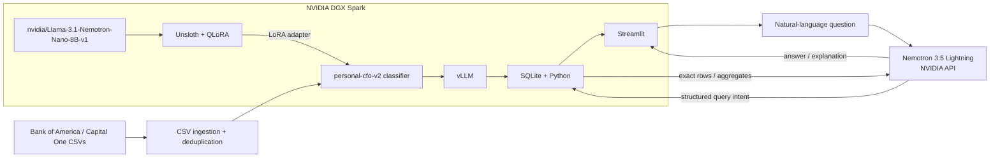

# Architecture

The local classifier is a LoRA adapter fine-tuned from `nvidia/Llama-3.1-Nemotron-Nano-8B-v1` with Unsloth + QLoRA and served with vLLM on DGX Spark.

Nemotron 3.5 Lightning handles semantic query planning and higher-level reasoning. Python and SQLite perform exact financial calculations.
